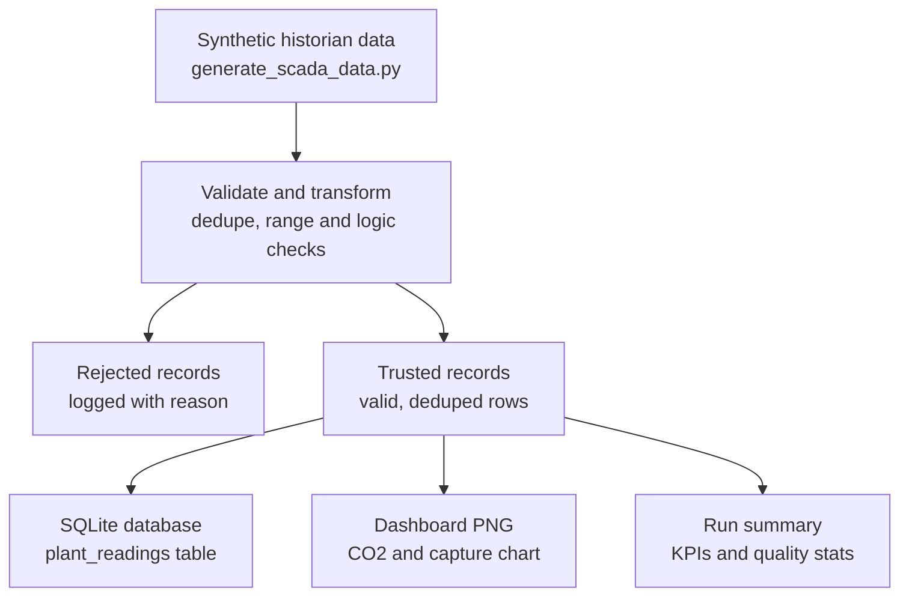

# Synthetic DAC Plant Data Pipeline

A small, honest learning project that shows how plant sensor data can be collected, checked, and turned into useful information — built to practise the kind of data pipeline used in real industrial monitoring systems.

> **This is an independent learning project.** It uses synthetic (made-up) data only. It does not contain real DACMA plant data, real company systems, or real operating limits.

## What this project does, in one sentence

It takes raw plant sensor readings, checks whether each reading makes physical sense, keeps only the trustworthy ones, and turns them into a database, a dashboard, and a summary report.

## Pipeline diagram



## Questions this project can answer

- How much CO₂ is removed between the inlet and outlet streams?
- Is the capture rate stable over time?
- How efficient is the simulated capture cycle compared to a defined target?
- How much fan energy is used per kilogram of CO₂ captured?
- Which sensor readings should be trusted, and which should be rejected — and why?

## How the data is checked (data quality)

Every reading has to pass these checks before it is trusted:

1. **No duplicates** — the same timestamp and plant ID is only kept once.
2. **No missing values** — a reading with a missing field is dropped.
3. **Realistic ranges** — temperature, pressure, airflow, CO₂ levels, fan power and capture rate must all fall within physically sensible limits.
4. **Physical logic** — the CO₂ leaving the plant must always be lower than the CO₂ entering it. If it isn't, the reading is rejected.

Readings that fail any check are not just deleted — they are saved to `output/rejected_records.csv` along with a plain-English reason (for example, "pressure out of range"), so nothing disappears silently.

Full rules are documented in [`docs/data-quality.md`](docs/data-quality.md).

## KPIs calculated

The pipeline works out CO₂ removed, capture rate, energy used per kilogram captured, capture efficiency, and how the plant compares to a defined nominal target. These targets are simulation assumptions only — not real engineering limits. Full definitions are in [`docs/kpis.md`](docs/kpis.md).

## Repository structure

```text
.
├── .github/workflows/         # CI: runs the tests automatically on every push
├── data/raw/                  # Synthetic input historian export
├── data/processed/            # Generated SQLite database (ignored by Git)
├── docs/                      # KPI definitions and data-quality rules
├── output/                    # Dashboard, run summary, and rejected records
├── tests/                     # Automated tests for the validation rules
├── generate_scada_data.py     # Creates the reproducible input data
├── run_etl.py                 # Validates, transforms, loads and reports
├── pytest.ini                 # Lets pytest find run_etl.py from the tests folder
├── requirements.txt
└── README.md
```

## Run it yourself

```bash
python -m pip install -r requirements.txt
python generate_scada_data.py
python run_etl.py
```

This creates:

- `output/dac_plant_dashboard.png` — a chart of CO₂ levels and capture rate over time
- `output/etl_run_summary.md` — a summary of what passed and failed, plus the KPIs
- `output/rejected_records.csv` — every rejected reading, with a reason
- `data/processed/dac_scada.db` — a SQLite database with a `plant_readings` table

## Tests and continuous integration

Run the tests locally with:

```bash
pytest -v
```

Every time code is pushed to this repository, GitHub Actions automatically installs the project and runs these tests. If a test fails, it shows up immediately — this is what keeps the validation rules reliable as the project changes.

## Reproducibility

The data generator uses a fixed random seed, so running it again produces the exact same dataset and results every time.

## Scope and limitations

This project is intentionally small and transparent, to show clear thinking rather than to imitate a production system. A real production pipeline would also need: secure connections to real plant systems, access control, secret management, schema versioning, monitoring and alerting, retry handling, audit logging, and engineering-approved thresholds set by real plant experts — not by me.
