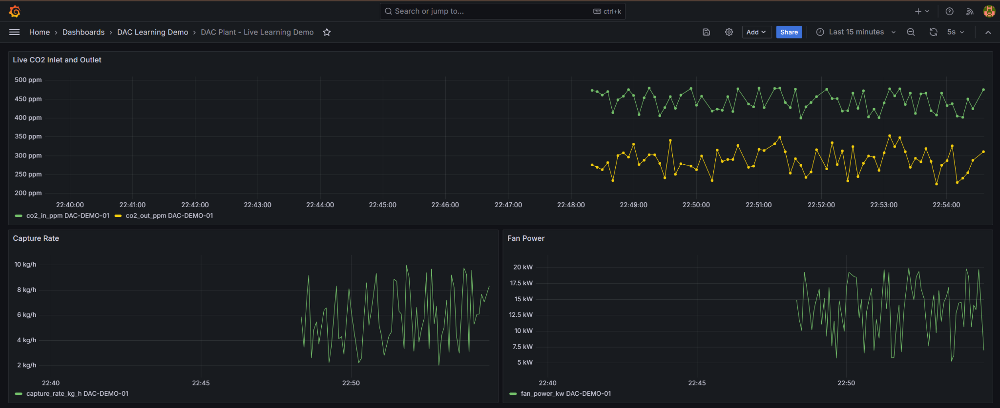

# DAC Plant Data Pipeline - Learning Demo

A Python project that turns synthetic Direct Air Capture (DAC) plant readings into trusted data, operational KPIs, and monitoring views.

> This is a personal learning project. It uses synthetic data only and is not connected to a real plant, company system, or production SCADA environment.

## What the project demonstrates

- Reproducible generation of synthetic industrial time-series data
- Data-quality checks for duplicates, missing values, ranges, and process logic
- Clear logging of rejected records and their reasons
- Loading trusted records into SQLite
- Calculation of CO2-removal, capture-rate, and energy-intensity KPIs
- A generated monitoring dashboard and ETL summary
- Automated tests and GitHub Actions
- An optional live MQTT -> validation -> InfluxDB -> Grafana extension

## Architecture

### Batch pipeline

```text
Synthetic CSV -> Python validation -> trusted/rejected split
              -> SQLite -> KPI report + dashboard
```

### Optional live pipeline

```text
Plant simulator -> MQTT -> Python validation -> InfluxDB -> Grafana
                              |
                              -> rejected-record log
```

The live mode reuses the same validation rules as the batch mode, which prevents the two pipelines from applying different quality rules.

## Verified results

The batch pipeline was executed with the included reproducible dataset:

- **578** synthetic raw readings generated
- **572** trusted readings loaded into SQLite
- **6** rejected readings retained with clear reasons
- **6** automated validation and ETL tests passed

The optional live pipeline was also tested locally with Docker. The simulator published a reading every five seconds through MQTT. Valid readings were stored in InfluxDB, deliberately injected faults were rejected, and Grafana displayed the accepted data in real time.



The screenshot shows three live views: CO2 inlet versus outlet, capture rate, and fan power. The displayed values are synthetic.

## Repository structure

```text
.
|-- .github/workflows/tests.yml
|-- data/raw/dac_scada_readings.csv
|-- docs/
|-- grafana/
|-- mosquitto/mosquitto.conf
|-- output/
|-- tests/
|-- compose.yaml
|-- generate_scada_data.py
|-- ingest_stream.py
|-- run_etl.py
|-- simulate_plant_stream.py
`-- validation.py
```

## Run the tested batch pipeline

```bash
python -m pip install -r requirements.txt
python generate_scada_data.py
python run_etl.py
```

Outputs:

- `output/rejected_records.csv` - every rejected row and its reason
- `data/processed/dac_scada.db` - trusted readings in `plant_readings`
- `output/dac_plant_dashboard.png` - CO2 and capture-rate trends
- `output/etl_run_summary.md` - data-quality counts and KPIs

## Run the tests

```bash
python -m pip install -r requirements-dev.txt
python -m unittest discover -s tests -v
```

GitHub Actions runs the same test command on every push and pull request.

## Run the optional live demo

Prerequisites: Docker Desktop and Python 3.10 or newer.

1. Copy `.env.example` to `.env` and keep `.env` private.
2. Start the local services:

```bash
docker compose up -d
python -m pip install -r requirements-streaming.txt
```

3. Use two terminals. The Python listener loads `.env` automatically:

```bash
python ingest_stream.py
```

```bash
python simulate_plant_stream.py
```

4. Open `http://localhost:3001`. The provisioned dashboard is in the **DAC Learning Demo** folder.

The MQTT broker is anonymous only inside this local demonstration and its port is bound to `127.0.0.1`. A real deployment must use authentication, encryption, restricted network access, managed secrets, and approved engineering limits.

## Data-quality rules

A reading is trusted only when:

- its timestamp and plant ID are present;
- required sensor values are present and numeric;
- temperature, pressure, airflow, CO2, power, and capture rate are within demo limits;
- outlet CO2 is lower than inlet CO2;
- it is not an older duplicate for the same timestamp and plant ID.

All limits are assumptions for synthetic learning data. They are not real plant limits.

## Current limitations

- No real SCADA, OPC UA, historian, or company connection
- No production security or access-control design
- No retry queue or durable streaming broker
- No engineering-approved alarm thresholds
- SQLite is used only for the small batch demonstration

## Possible next steps

- Add an approved OPC UA or historian connector
- Add schema validation and a dead-letter queue
- Add retry handling, metrics, and alerts
- Add integration tests for the container stack
- Replace local services with production-approved infrastructure
